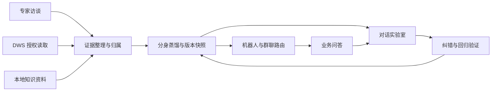

# 架构与演示范围

访谈、采集和蒸馏是工作角色与阶段，不代表三个相互独立的自主 Agent。实际执行由 Claude Agent SDK 驱动，按需加载 Skills、MCP 和数据工具。

分身核心资料包括 CLAUDE.md、SOUL.md、STYLE.md、Q&A.md、USER.md 和 MEMORY.md。长材料在知识工作区按需检索；对话、记忆、版本与反馈有各自的存储和作用范围。

机器人路由绑定已发布的分身版本。应用本地运行时，其在线服务能力依赖电脑、应用进程、网络与模型服务保持可用。

本仓库不包含生产数据、凭据或私有知识库。通用测试验证工程行为，不等同于业务准确率证明。
